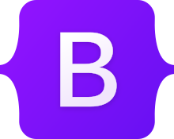

## Introduction:
Like a baby's first steps, raw HTML and CSS are a joy to learn and watch. It’s magical to see a site form in front of you, opening new doors and opportunities. However, much like a baby’s first steps, it can be a tad clumsy. That is not to say it is bad, but it can only go up from here.

## UI Framework With Bootstrap 5:
While raw HTML and CSS are great for making a quick simple website, achieving a stunning website demands many hours to be poured into decorating and positioning things just right. However, this can be streamlined with a UI framework, which is a pre-designed set of tools, components, and guidelines that simplify the process of creating user interfaces for websites and applications. There are numerous UI frameworks to pick and choose from, such as Bootstrap 5, a popular HTML, CSS, and JavaScript framework for creating responsive, mobile-first websites.

Although at first glance, Bootstrap looks just as complicated as HTML and CSS, which it can be, it offers a much greater toolset for developing beautiful websites that work well on both desktop and mobile fast. It does this by automating and standardizing things such as columns and navbars and making them respond to the device it is running on. While there is a lot of room to customize these things, Bootstrap 5 does limit you in some ways to account for different screen sizes and displays. This acts as both a blessing and a curse. It is helpful when trying to format everything correctly and a bit tedious when you want something specific.

## Thinking Inside The Box:
As previously mentioned, UI Frameworks like Bootstrap 5 can be limiting, but because of this, it allows you to disregard the nitty gritty of styling everything by hand and focus on the bigger picture. For example, rather than spending hours making a button look pretty, I could be spending my time making a site more functional. Like any tool or technology, UI frameworks are meant to be an aid for a job, making it easier and faster.

However, it is important to remember that not every problem can be solved with a single tool. Like any good professional, they need a diverse toolkit. UI frameworks like Bootstrap 5 are one of those essential tools, but they work best when complemented by the creative flair of raw HTML and CSS.

## Let’s Compare:
As an example, I attempted to recreate a small portion of the popular online graphing calculator website Desmos in Bootstrap 5 with minimal CSS.

Although it’s not one-to-one and doesn’t have all the fancy bells and whistles, my recreation was only done in a couple of hours. With Bootstrap 5, I was able to quickly style and place things into the site with minimal tinkering. Compared to raw HTML and CSS, a UI framework like Bootstrap 5 expedited the design process.

## Conclusion:
In conclusion, raw HTML and CSS are like the first steps in any software engineer’s life. It is the foundation of web development and provides the groundwork for making an excellent website or application. UI frameworks, on the other hand, provide a simpler and faster method but put restrictions as to what you can do. There are pros and cons, but learning to work inside the box can help free your ideas and innovate.

Desmos Recreation Github: [e36-desmos](https://github.com/thomasarivera/e36-desmos)
