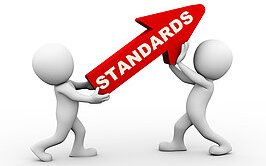

## Introduction:
In our world, standards act as the bedrock of civilization. They function as the threads that hold society together, ensuring its smooth operation. Without standards, chaos reigns supreme. This principle goes for coding as well.

## Standards In Coding:
In English, we have grammar standards that allow us to effectively and efficiently communicate. Because coding is another form of communication, we have rules that help with clarity. Disregarding grammar or coding rules hinders our ability to understand each other. Some may argue that specific coding standards appear trivial, such as the number of spaces for indentation or the placement of closing curly braces. However, beneath these seemingly minute details lies significant benefits.

In my Software Engineering class, we practiced using a stricter standard using ESLint with IntelliJ. At first, I found this change funny as I saw all my code light up with red error markings, indicating that the code was not up to standards. I spent a good five minutes fixing my mistakes, but the end result was magnificent. Not only did it look pretty, but the standardized text made it clean, clear, and easy to read. Managing code was made easier after this revelation and made me more conscious about what I write.

When I look back at my first-ever big coding project, something sticks out. My coding standard was terrible! Inconsistent spacing, unneeded empty lines, and, worst of all, bad variable names. It wasn't easy to follow at times. Similar to English, having bad coding standards is like having bad sentences, lacking punctuation and nonsensical words thrown in.

## Conclusion:
Although not everyone agrees on a single standard, having them is better than nothing. While adjusting to a new way of coding was challenging, the end product is better and cleaner to boot. Just as grammar rules make language coherent, coding standards make software comprehensible.
