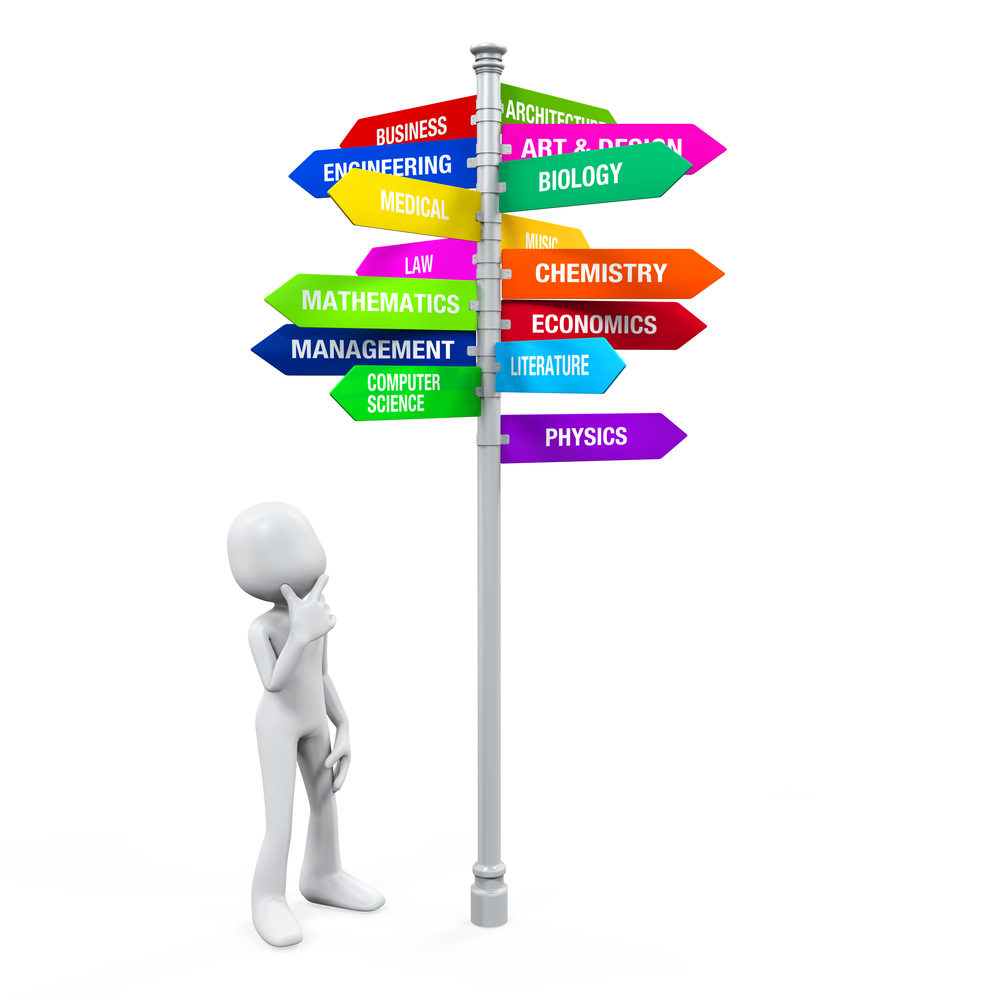

## Too Many Options:
Computer Science is a massive career field. It is a wondrous feeling to have the world at my fingertips being privileged enough to choose what I want to do. But I have to choose at some point. Currently, I have an interest in becoming a computer network engineer or a software developer. I find the process of creating something from nothing to be satisfying, and both of these jobs give me that warm feeling. 

## Software Engineering:
Since beginning my ICS 314 Software Engineering class at the University of Hawaii, my interest in software engineering has really grown. The passion I felt from my professor and classmates around me has really motivated me to do better and improve exponentially. I am excited to learn more than I have ever had in the last couple of years and can not wait to see where I land. 

High hopes and good vibes are sadly not enough to succeed, though with hard work and dedication, I know I will get there someday. ICS 314 was a class I didn’t know I needed: It was a wake-up call to start grinding again, to start seizing the day again. 

Although software engineering may not be my career of choice, the lessons and skills of development I am experiencing will help me anywhere in life. For example, the development of my coding skills has put an emphasis on my lack of practice. Knowing this, I can really focus on improving my problem-solving skills and the ability to think quickly. While I was already able to solve difficult problems, speed is an important factor when it comes to professional work. 

## Engineering My Future:
Sometimes, time can move really fast, and it scares me. But that’s not all bad, because I at least can choose what to do with that time. With my time almost up at school, it’s time that I really get serious about my career. In the future, I plan on obtaining numerous certificates such as the CompTIA A+, CompTIA Network+, and CompTIA Security+. Learning also won’t stop in the classroom, where I am starting to make my own home lab where I can test new technologies and get first-hand experience. I am excited for the future and can’t wait to learn even more. 
