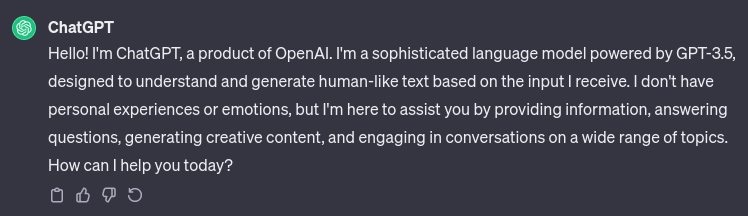

## Introduction:
With the release of artificial intelligence (AI) to the masses, concerns about how this new technology will be used have caused many to worry. Whether it’s academic dishonesty or the obsolescence of jobs, AI carries baggage that helps humanity advance and creates waves that have made industries worried. ChatGPT and GitHub Co-Pilot are AIs I have experience with and have proven to be powerful tools that make the average user a pro. The ability of ChatGPT to generate human-like text and GitHub Co-Pilot's assistance in code generation for Software Engineering highlights the immense potential for AI to augment human capabilities, fostering creativity and efficiency in unprecedented ways.

## Personal Experience With AI:
During my time in my software engineering class at the University of Hawaii at Manoa, I tried AI in multiple situations. Here are some examples and the results I got:

#### 1. Experience Work Out of The Day (WOD):
When learning the material in preparation for the class WOD, ChatGPT has been helpful in troubleshooting my issues. Sometimes, Googling can be frustrating when you can’t find the exact solution, but because ChatGPT can be fed your code, the AI is given context as to what the problem is.

#### 2. In-Class Practice WODs:
I tried using ChatGPT by copying the problem. From this, I was able to learn new methods and solutions.

#### 3. In-Class WODs:
ChatGPT was a last resort method when I could not get my solution to work before time was up. When stumped, I simply copied what I got so far along with the problem. ChatGPT would then finish my code for me.

#### 4. Essays:
Although ChatGPT is a great writer, it is also generic. As a result, I avoid using AI and rely on my ability to be creative. However, when I encounter writers block, AI can help me break through it by providing some ideas.

#### 5. Final Project:
Learning to implement a QR code generator and scanner was confusing, with Google searches providing outdated information. ChatGPT was able to recommend and instruct me on how to download a library and implement it.

#### 6. Learning A Concept / Tutorial:
When going through documentation, I tried copying it and prompting the AI to summarize it. It is helpful when learning but leaves a lot of details out that could be useful.

#### 9. Answering A Question In Class or In Discord:
I never thought of trying this since I always tried to answer to the best of my ability.

#### 8. Asking or Answering A Smart-question:
ChatGPT is helpful in formulating a question when I can’t quite word it correctly. However, it’s also very useful in answering my questions, and as a result, I rarely ask questions.

#### 9. Coding Example:
For my final project, I asked ChatGPT to write me an example code for my QR code generator. It was able to provide some code; however, some parts were out of date due to the data it was trained on.

#### 10. Explaining Code:
After plugging in my code, ChatGPT is able to explain what the code does step by step and even makes suggestions where there could be improvements.

#### 11. Writing Code:
Both ChatGPT and GitHub co-pilot are great at writing code. ChatGPT is strongest due to it having context for the problem. I can simply prompt the problem, and the AI does its best to solve it, with success most of the time. When it comes to GitHub co-pilot, its coding knowledge is more up-to-date compared to ChatGPT and is helpful in code completion and formatting. However, because it has no context of the problem, co-pilot struggles to generate the correct code from scratch.  

#### 12. Documenting Code:
ChatGPT is already great at explaining code, so it's also fair to say it’s good at documenting code. I have tried this when debugging a QR code generator. I asked it to write comments above what each function does, and it did it quickly.

#### 13. Quality Assurance:
ChatGPT and GitHub co-pilot have been extremely helpful in keeping my code clean and clear. Co-pilot gives recommendations as to how to finish a block of code and attempts to keep it in your style. ChatGPT can quickly find mistakes, such as typos or incorrect use, and fix them. It also helpfully provides an explanation of what the error was and how to fix it.

#### 14. Discovering New Technologies:
With more information always being published to the web, search engines have started to feel useless where my searches result in outdated or incorrect information. After some time using ChatGPT and experimenting with what it knows, AI has started to become my goto for searching technical information. Not only does it directly give me the information, it’s also capable of providing examples and implementation. ChatGPT feels like your own personal Wikipedia that can search its database using regular language rather than search terms. For example, when looking for a QR code library, I simply asked what it recommended I use for a meteor.js application. It then promptly provided me with a list and instructions on how to use them. Using a search engine would most likely not provide me with relevant information.

## Impact On Learning and Understanding:
The introduction of the internet already brought people all the information of the world to their fingertips, but AI takes that further with ChatGPT taking that information and converting it into a simple and easy-to-understand format all in one place. The ability to learn new things has never been easier, but it does bring in ethical concerns. Is what is generated true? Because the AIs such as ChatGPT are trained off the internet, not all information is correct. It creates some distrust for its answer; however, any 3rd party source should be viewed as the same. This is especially true when using AI as a source for learning. I have tried to use AI when learning how to implement a function. The results were amazing as it quickly provided me with easy-to-follow instructions. One downside to this is it did not allow me to struggle and learn as much. As mentioned before, the reliability of the information generated is not solid: demonstrated by the minor errors from the generated code.

## Practical Applications:
During the 2023 Hawaii Annual Code Challenge, I tried asking ChatGPT what would be a good solution for ensuring people return reusable containers. The results were okay as it generated a general solution and regurgitated the provided guidelines. Perhaps it needed better input, but that would require more work than it is worth. Although it was able to create a decent response, AI is not quite at that level where it can make an in-depth solution. AIs like ChatGPT have shown to me that they can answer smaller questions but struggle to answer the problem as a whole.

## Challenges and Opportunities:
While developing my application for my Software Engineering class, AI played an assistant role. The biggest limitation to AIs like ChatGPT is the lack of current information. At the time of this essay, ChatGPT has been trained with data up to 2021, resulting in outdated documentation. This is very annoying when trying to debug code and can make it worse when you don’t pay attention to what the AI is doing. This brings up the responsibility of humans to ensure that AI is being reasonable.

AI is such an amazing technology and opens the door to many possibilities for automation, ease of use, and learning. I found that AI is very helpful when it comes to learning new coding languages. This is because it is able to translate code to another language, making it easier to see where nuances differ or are similar.

## Comparative Analysis:
Traditional teaching methods are always a solid choice, that’s because it’s traditional. However, AI has the chance to enhance learning with the ability to answer unique questions and provide solutions. On the other had, this may not be the best as students may become reliant on it. Traditional teaching methods helps foster critical thinking and a deeper understanding of the topic.

## Future Considerations:
As AI becomes more advanced, there is no doubt that people who want to get into Software Engineering need to learn to use AI. With tools like ChatGPT that allow for creating a skeleton of a project and GitHub co-pilot’s ability to generate code, the development will be faster than ever. Those who don’t use AI will be left is the dust. In the future, software engineering education should include how to prompt AIs and how to use it responsibly.

## Conclusion:
The introduction of AI to the public has made waves in our society. It is a powerful tool that allows the average user to become a pro. AI will one day replace us, but it’s important to remember that we can’t be fully replaced. With the human ability to think critically, we won’t be going anytime soon. In the meantime, AI will become a vital tool in software engineers' toolkits and help speed up the development of future technologies.
