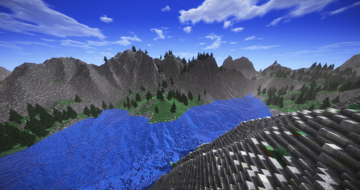

## Introduction:
One of my earliest encounters with online multiplayer gaming was through Minecraft. While I didn't fully grasp its significance at the time, I now consider it a technological marvel, allowing me and others to engage in simultaneous gameplay. With a more profound understanding of computers and the internet today, I was inspired to embark on a journey to set up my very own Minecraft server.

## Running a Minecraft Server:
Creating this Minecraft server marked my entry into the realm of networking. My primary objective for this project was to establish a private server to enjoy with my friends. To make it happen, I first needed to select the right hardware for the job. For this endeavor, I acquired a quad-core CPU with 4 GB of RAM, running on Ubuntu Server, and equipped with a 256 GB SSD. To power the server, I employed Minecraft's official server software.

The most challenging aspect of this project was acquainting myself with the command line interface on Ubuntu Server. Thanks to the assistance of provided manuals and some brief tutorials on the command line, I adeptly navigated Ubuntu's interface. The setup of the Minecraft server itself turned out to be relatively straightforward, involving the download and extraction of the software, followed by configuring a document using GNU Nano. Subsequently, I performed the uncomplicated task of configuring port forwarding on my home router.

Seeing the server come to life was a truly exhilarating experience. After configuring the IP address, I promptly shared it with my friends and subjected it to rigorous testing by simulating a substantial load. We discovered that the hardware coped well, delivering a smooth gaming experience for up to eight players, with only minor occasional hiccups.

Another essential step in this process was securing my network. The presence of port forwarding on my home network inherently posed security risks. To mitigate this, I implemented a whitelist system. I diligently collected the IP addresses of all players, and only those individuals were granted access to my network after being added to the whitelist.

## Future Improvements:
While the official Minecraft server software is user-friendly, it has its limitations, such as a lack of customization, optimization, and anti-cheat measures. Notably, new Minecraft updates sometimes render the server unusable due to slow update deployment from the server software. In the future, I would like to creation a custom solution or the exploration of alternative open-source projects to address these issues.

Furthermore, one area I'm keen on improving is data management. Currently, the server lacks a backup system, which means that everything could be lost if the SSD were to fail. In my quest for solutions, I stumbled upon the 3-2-1 Rule, emphasizing the necessity of having three copies of data on two different types of media, with one copy stored off-site. This approach not only offers a remedy for my specific problem but also proves invaluable for other projects.

Although the scope of this project may have been relatively modest, it represents a significant leap in expanding my horizons and exemplifies the boundless possibilities within the realm of computer networking. This journey has been a testament to the remarkable capabilities of technology and the exciting potential it holds.