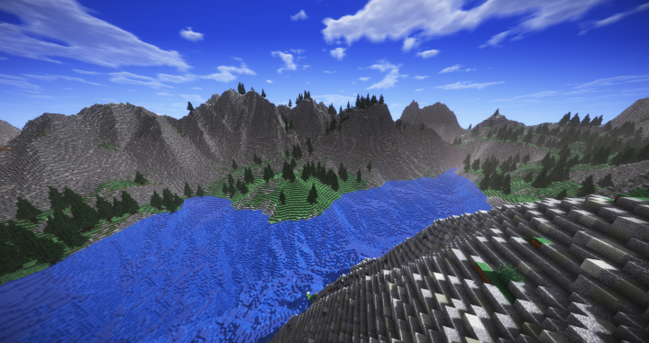

## Introduction:
One of my first introductions to online multiplayer games is Minecraft. While I didn’t think much of it back then, I see it as a marvel of technology today, allowing me and others to play the same game simultaneously. Now, with more knowledge of computers and the internet, I wanted to try my hand at making my own server.

## Running a Minecraft Server:
Creating this Minecraft server marked my first step into the world of networking. My goal for this project was to create a private server for me and my friends. In order to run it, I first needed to spec out a computer to run the server. In this project, I got my hands on a quad core CPU with 4 GB of ram running Ubuntu Server and a 256 GB SSD. For the server, I used Minecraft’s official server software. 

The hardest part of this project was learning how to use the command line on Ubuntu Server. With the help of the manuals provided and some quick tutorials on the command line, I successfully was able to interface with Ubuntu. The Minecraft server setup was quite simple, only requiring the downolading and unzipping of the software, then some configurations in a document using GNU nano. Next, I did the simple task of setting up portfowarding on my internet router.

Getting the server up and running was an exciting experience. After setting up the IP address, I quickly shared it with my friends and began to test it by putting a load on it. We found that for 8 people playing at once, the hardware was sufficient for a smooth gameplay experience with some minor hiccups in rare cases. 

Another thing that had to be done is the securing of my network. Having portfowarding on my home network can obviously have some major risks, so i decided to setup a white list. In order to do this, I collected the IP addresses of all players. After adding them to the white list, only those players can access my network.

## Future Improvements:
While the official Minecraft server software is simple to use, there is a lack of customization, optimization, and anti-cheat. For example, new Minecraft updates render the server unusable due to the slow update times on the server side. In the future, a custom solution may be created or other opensource projects could be utilized.

Another aspect that I would like to improve is data management. In its current form, the server has no backup, meaning everything can be lost if the SSD were to break. While exploring options, I learned about the 3-2-1 Rule, which means there should be 3 copies of the data on 2 different types of media and with 1 copy being off-site. This method is an excellent solution for my problem and is also handy for other projects.

Although the project was a bit small in scope, it has been a giant step in broadening my horizons and seeing what is possible in the world of computer networking. 
