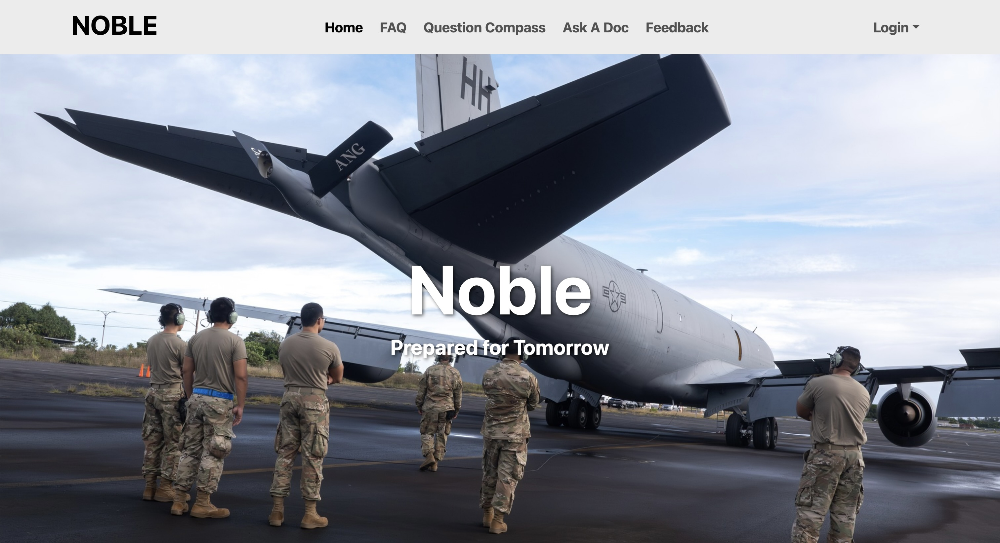
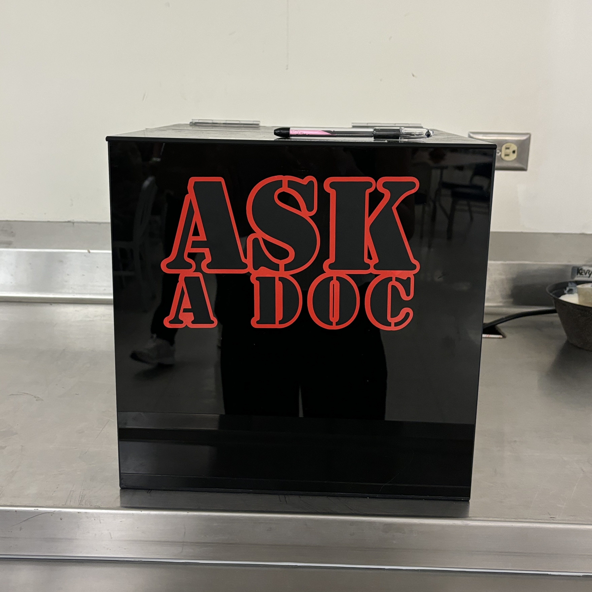
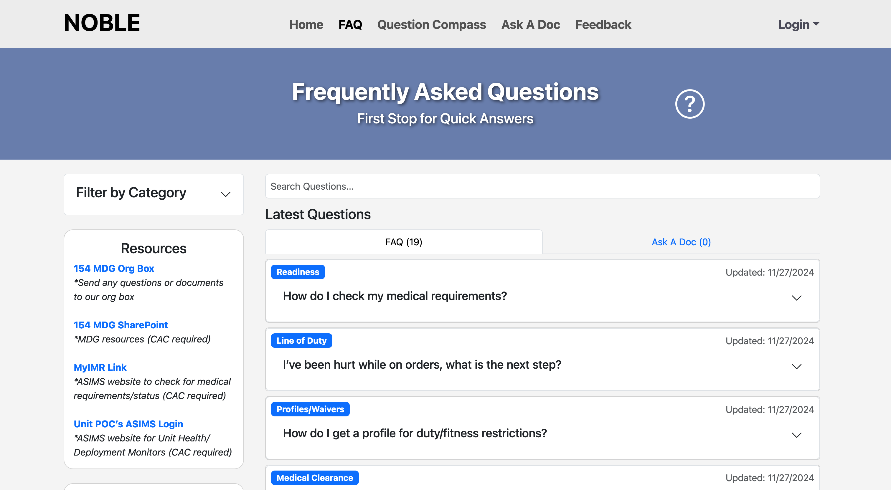
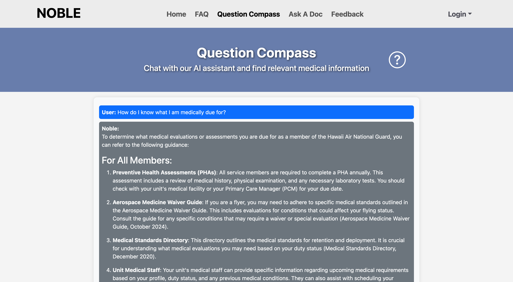
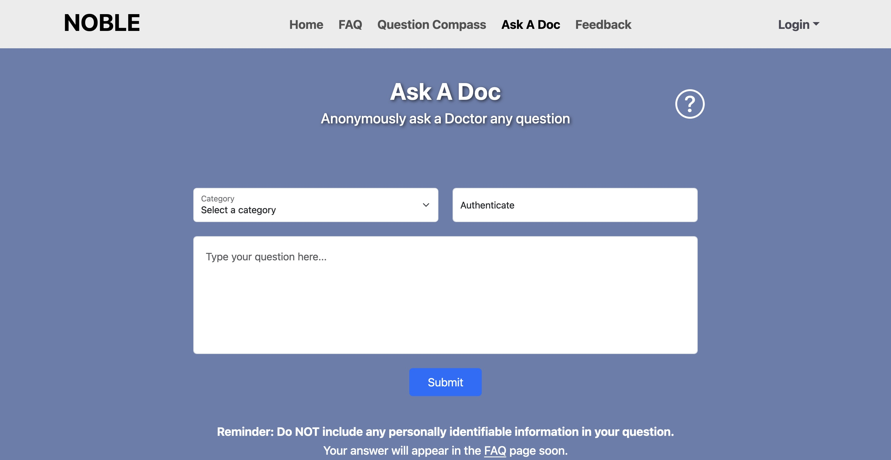
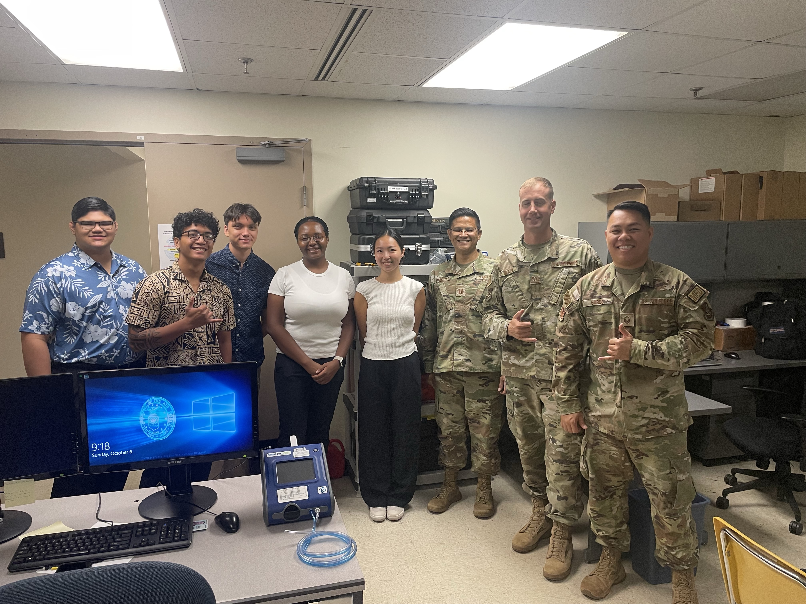
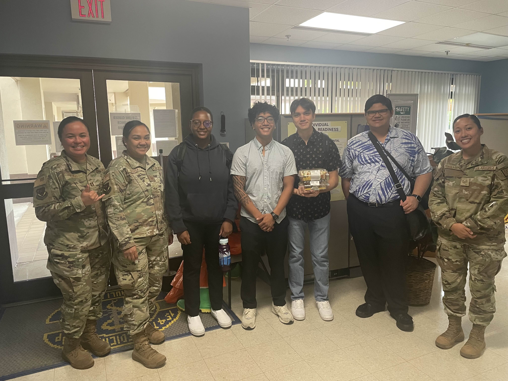

    

`Language(s):` Javascript, HTML, CSS

`Frameworks/Libraries:` React.js, Meteor.js, React Bootstrap, TestCafe

`Database:` MongoDB

## Problem:

Medical readiness is essential for maintaining membership in the Hawaii Air National Guard (HIANG), with requirements varying by career field. For instance, flight crew members face stricter medical standards than those in administrative roles. The 154th Medical Group (154 MDG) oversees medical readiness for 2,300 HIANG members, following complex procedures and guidelines. However, concerns about the potential career impacts of disclosing medical issues discourage members from seeking help, even anonymously.

Despite implementing an anonymous “Ask a Doc” dropbox for questions, no queries have been submitted in three months, highlighting a lack of trust in the process. Members fear that revealing medical conditions could lead to restrictions or separation from service.

    

## Our Solution

Noble is a web app designed to support the medical readiness of Hawaii Air National Guard (HIANG) members by providing reliable, anonymous, and accessible health information. Noble includes three main features:

- **Frequently Asked Questions (FAQ):** A searchable and sortable database of straightforward answers to common medical questions.

    

- **Question Compass:** An AI chatbot trained on Air Force Medical Standards and procedures to provide personalized guidance.

    

- **Ask A Doc:** An anonymous platform for users to submit medical questions when they cannot find answers elsewhere.

    

Noble addresses the critical need for a secure and private platform that fosters trust, encourages transparency, and empowers service members to manage their medical readiness confidently.

## Contributions:

Acting as the Subject Matter Expert and project lead, I worked with the Hawaii Air National Guard (HIANG) to develop solutions and features for Noble. As a team, I assisted in user research and testing, conducting over 60+ in-depth interviews and 2 site visits, to gain a deeper understanding of members' needs and pain points.

    

        
    

    

        
    

As a key contributor to the development of Noble, my responsibilities included refining the application based on user feedback, ensuring seamless integration with existing systems, and collaborating with the 154th Medcial Group to address any concerns or issues that arose during the project.

I worked on the front and back end, creating new features and managing their progress. Back-end development involved creating collections, methods, and the backend for our Question Compass AI Chatbot using a flask app. On the front end, I immersed myself in user interface design that works great on both desktop and mobile devices.

## What Went Well:

Effective integration of user pains and gains through feedback and interviews ensured that Noble addressed the unique needs of the HIANG Service Members. The end result shows a more user-centered and empathetic application. This is critical since trust was the largest concern based on our interviews.

Given our limited timeframe, about 2 months of development, the team worked tirelessly to produce a high-quality solution despite the challenges. Strong teamwork and collaboration enabled us to overcome obstacles and deliver a successful project that meets the needs of HIANG Service Members.

One of the standout features of Noble is the Question Compass, our AI-powered chatbot that provides personalized guidance and support to Service Members navigating complex medical needs. Trained on Air Force Medical Standards and procedures, this innovative solution addresses a critical pain point identified in our user research, enabling members to confidently manage their medical readiness with peace of mind.

## What Was Challenging:

Given the sensitive nature of medical information, ensuring data privacy and security was a significant challenge. We had to implement robust encryption and secure data handling practices to protect user anonymity and build trust in the platform. Furthermore, the psychology of trust proved to be difficult to overcome, requiring us to create a visually appealing and intuitive interface that would convey confidence and reliability.

Additionally, integrating the AI chatbot with accurate and up-to-date medical standards required extensive collaboration with medical professionals and continuous updates to the chatbot's knowledge base. With no prior experience in implementing AI chatbots, this was a steep learning curve, requiring significant time and effort to acquire the necessary skills and expertise.

## Improvements:

Future improvements could include expanding the AI chatbot's capabilities to cover more specific medical scenarios and integrating with other health information systems for a more comprehensive solution. Enhancing the user interface based on ongoing feedback and adding more interactive features could further improve user engagement and satisfaction.

## Team:

- **Subject Matter Expert:** Thomas Rivera
- **Subject Matter Expert:** Lauren Clayton
- **Project Manager:** Rina Ogino
- **Project Manager:** Ryne Stagen
- **Business Lead:** Brandon Underwood

## Links:

To see more about Noble, please visit the following links:

`Live Site:` [Noble](https://noble.wiki/)

`Source Code:` [GitHub Repo](https://github.com/AskADock/noble)
