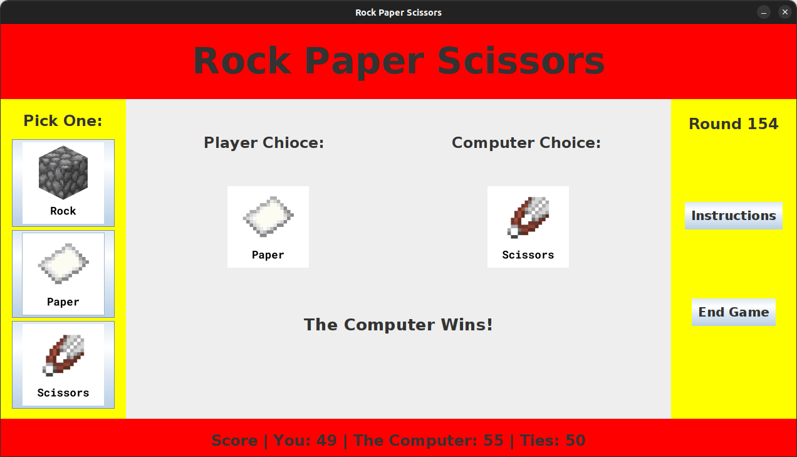

## Introduction:
In my ICS 211 class, we were assigned to create a Rock Paper Scissors game with a graphical user interface. It is a player versus computer game where the player will choose between rock, paper, or scissors and will be pitted against the computer who chooses at random. The game also keeps track of the score and logs it into a text document upon exiting the game.

## Creating a GUI:
Like all other projects, it begins with a plan. As part of my design process, I drew up a mock user interface, giving me a rough idea of what I was shooting for. I aimed to create something simple with easy-to-read text and images. 

In Java, Swing was used to create the GUI. Because this was the first time ever creating a GUI for my program, I found the process slow and tedious initially, but I eventually found my grove. The graphical user interface was by far the most challenging part of this project, with all the tiny adjustments needed. While looking back at this project, I accomplished my goal of creating a readable interface with a good flow.

## What I Can Improve:
For a first attempt, I found my GUI to be a good start. However, one thing that could be better is the aesthetics. Red and yellow may not be the most appealing. To give it a more modern look, a gray and white look may be more professional, but it could also make it look dull. If I were to make it again, I would use bright pastel colors that are easy on the eyes but evoke a sense of joy.

Source: <a href="https://github.com/thomasarivera/rock-paper-scissors">rock-paper-scissors</a>