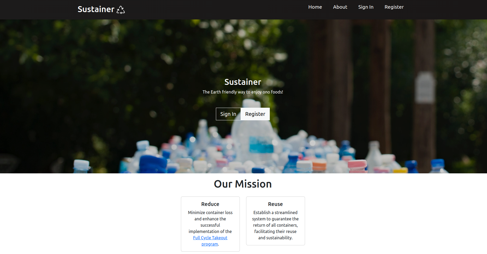
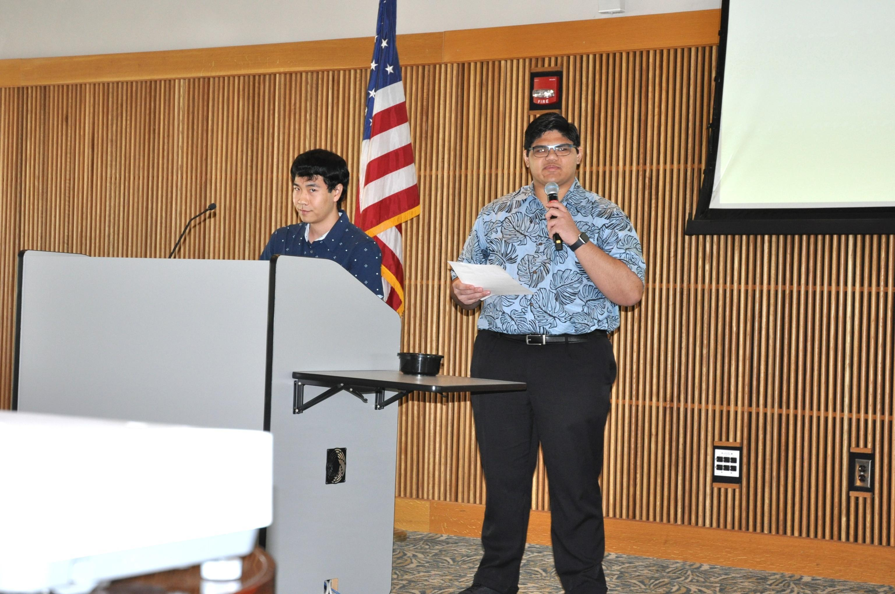
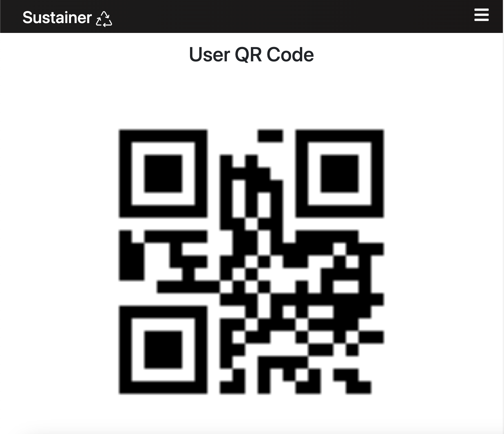
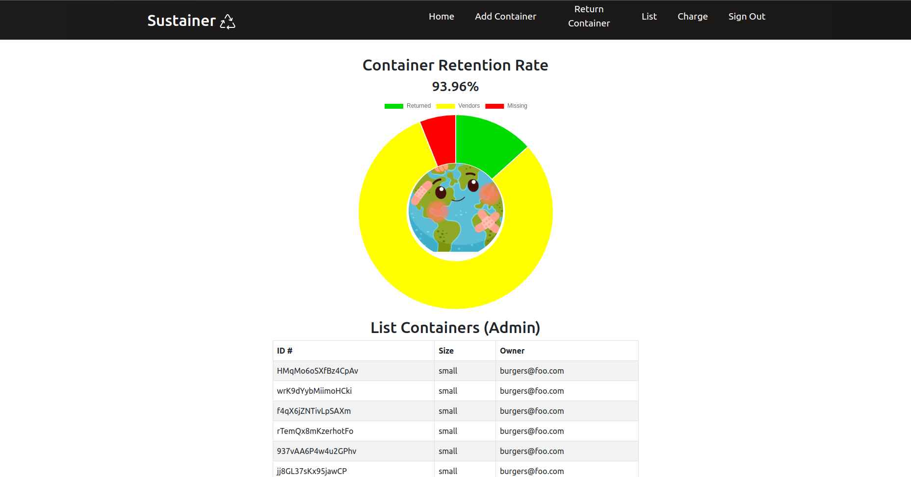
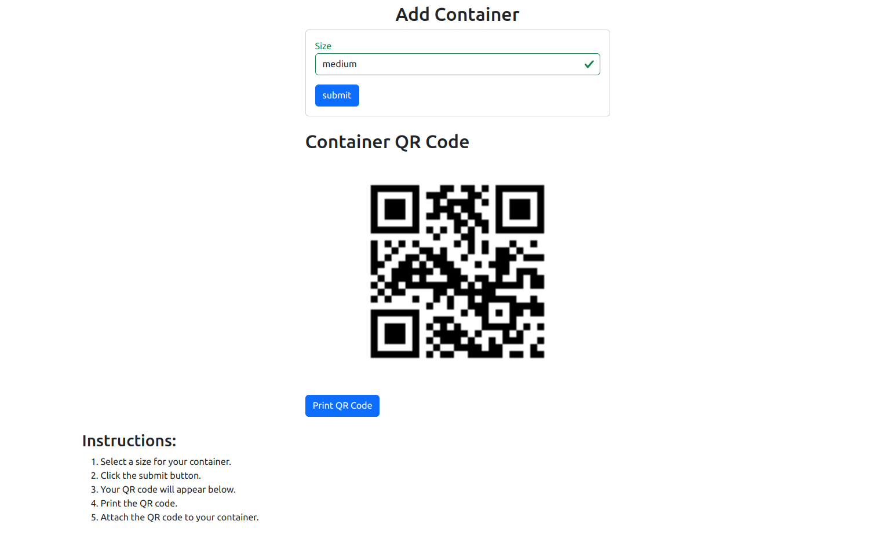
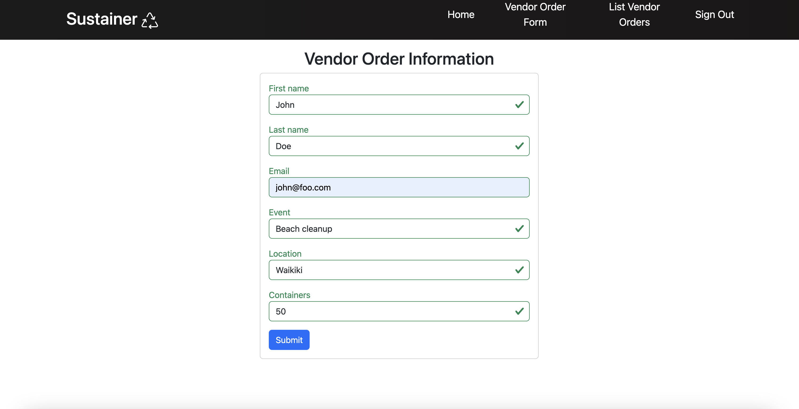
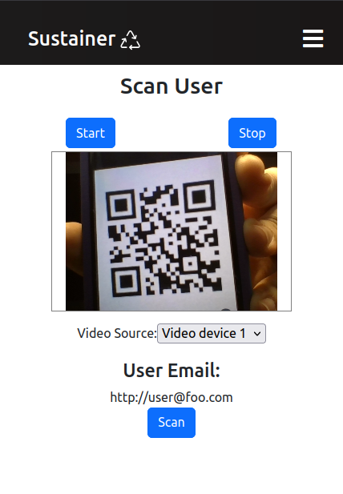

## Hawai'i Annual Code Challenge:
The Hawai'i Annual Code Challenge (HACC) is a hackathon started in 2015 by Gov. David Ige. It encourages civic engagement with the local technology community in modernizing state functions and services for a more effective, efficient, and open government. Over three weeks, the HACC generates proofs-of-concept by students, amateurs, and professional coders to benefit community and State agencies.

At the 2023 Hawai'i Annual Code Challenge, my team, Bit By Bit, participated in the event and tackled the Reusable Takeout Program App challenge. Our team was proudly chosen as a HACC finalist and presented at the University of Hawai'i West O'ahu.

Jaren Pinera and Thomas Rivera presenting Sustainer to the 2023 Hawai'i Annual Code Challenge at the University of Hawai'i West O'ahu.

 

## Problem Description:
Single-use takeout containers and food wrappers make up a significant portion—up to one-third—of the debris discovered along Hawai'i's shorelines. Currently, a reusable takeout container program, Full Cycle Takeout, by Zero Waste Hawai'i, aims to solve this problem by offering vendors and customers the ability to rent out containers. However, between 20% and 30% of reusable containers are not returned, making the program unsustainable financially and for the planet. With more containers needing to be replaced, Zero Waste Hawai'i is looking for a program that incentives users to return containers at large, fast-moving events.

## Our Solution:
Sustainer is a reusable container tracking app that assists users, vendors, and the non-profit Zero Waste O'ahu in staying accountable for the return of reusable containers at large events. It uses monetary incentives for users to return reusable containers. At events, users will use their phones to sign up for Sustainer, go to their preferred food vendor, scan their unique ID QR code, enjoy their delicious food, and return it! Users are charged $5 per missing container to keep them accountable.

For further detailing, please visit the <a href="https://sus-tainer.github.io/">Sustainer Organization Page</a>

## Tracking Containers:
Each container has a unique QR code for tracking in the Sustainer database. To lend and transfer container ownership, scan the user's ID and QR codes. Tracking is essential for ensuring the return of items and user incentives.

## User Roles:
#### Admin:
Zero Waste Hawaii can manage containers and their ownership. This includes adding new containers, returning them, charging users, and statistics view.

    

    

#### Vendor:
Vendors can order and rent out needed containers. These containers are then lent out to the users.

    

    

#### User:
Users can sign up, input payment cards, and get their ID QR codes. These QR codes transfer ownership of the container to the user.

    

## What Went Well:
Coming up with our solution was an adventure. Despite my team members being mostly strangers, our diverse backgrounds have shown to be a positive, with our perspectives bringing different ways of thinking. We benefited most when thinking about the procedure for users. The team spent many hours brainstorming, discussing, and debating, resulting in a solution that brought us to the HACC finals to present our idea.

## What Was Challenging:
Staying focused can be hard when you're beaming with ideas and solutions. New ideas kept coming to us during development and extending the project scope. Although what was added benefits the overall product, development time could have been shifted and utilized better. The team tried to avoid crunch time, but our submission came just in time with the ever-growing project and problems we kept running into.

Communication is vital in a team environment and requires all members to be on the same page. This was something that needed to be worked on. Although we had proper meeting times, we only had a little time to talk and discuss things. Instead, we focused on finishing the project.

## What Could Be Improved:
Overall, Sustainer was a complete package with all the features we wanted to include. There's no doubt that the team spread themselves thin, and as a result, some parts of the app turned out to need to be more polished. For example, the look and feel of the app needed more time to optimize for multiple screen sizes. Some functions are also buggy in certain areas and scenarios. These problems would have been solved with more time, but it's proof that we aimed for the moon and missed it, but we at least landed among the stars. With further development, security features need to be implemented. This includes account security with multi factor authentication. Furthermore, with the collection of sensitive information like credit cards, serverside security measures are also needed.

 

Source: <a href="https://sus-tainer.github.io/">Sustainer Organization Page</a>