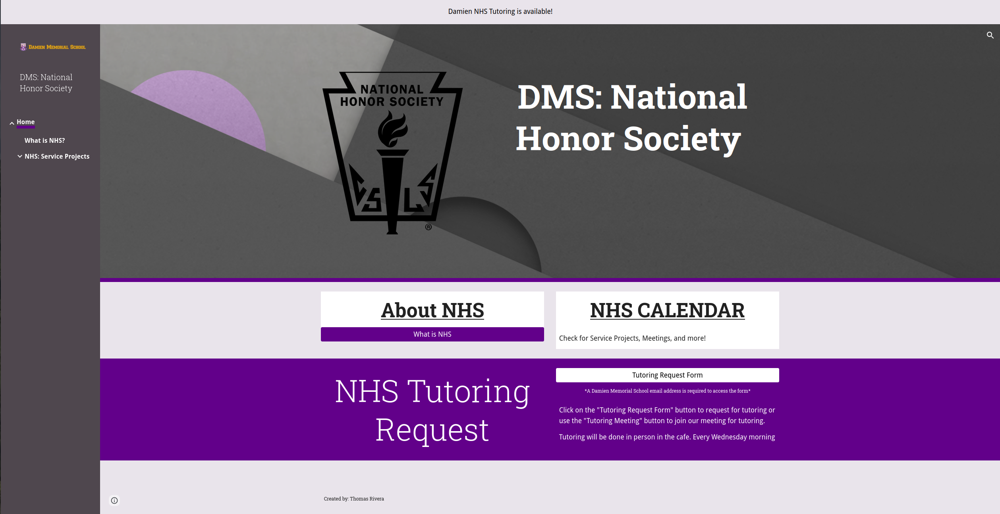

## Project Description:
The Tutoring Coordination Program is a program that will allow parents, about 700 students, 50 teachers, and the National Honor Society (NHS) of Damien Memorial School to collaborate, schedule, and organize tutoring using forms to collect information.

The information collected from the forms will help inform the NHS team on what subjects and grades need the most help with efficiency. The previous method relied on counselors and teachers to notify the NHS about tutoring; however, with the program, the NHS can now instantly get notified by the student. The Tutoring Coordination Program will allow the NHS to quickly plan and execute a solution to help the students effectively. For example, the form shows a trend of students struggling in Geometry. With this information, the NHS can now plan, schedule, and assign members who are proficient in Geometry to help tutor. The lack of a middleman improves the speed at which we receive information about struggling students and allows the NHS to help in a timely manner.

## What Went Well:
One thing that went well was the introduction of the Tutoring Program. Soon after the program was enacted and announced to the public, students quickly started to sign up for tutoring using the Tutoring Coordination Program website and form. I was surprised to see this turn of events, and shows how much of an impact this program could have. Some comments from students, parents, and teachers include:

>“Having this program is important, especially in times of social distancing” - DMS Teacher

>“I’m glad that you made that program; it’s good for those who are struggling.” - DMS counselor

>“I would rate this tutoring service a 5 out of 5.” - DMS Student

>“Thank you for helping my son.” - Parent

## What Was Challenging?:
The most challenging thing was motivating people to help with the tutoring program. I believe because of COVID-19, the NHS Members were at lower morals, causing the amount of tutoring shift sign-ups and the amount of advertising for the program to be smaller. Over time, however, this improved as more people signed up to do tutoring and helped to promote it as we saw more and more students using the Tutoring Coordination Program. To promote the program, school-wide emails were sent, and teachers and counselors promoted it to thier students.

Due to COVID-19 and social distancing, tutoring had to be done online via Zoom. While it did not affect the system, it changed how we interacted with students, teachers, counselors, and parents. Instead of meeting with students face to face, I created a Zoom meeting for the tutors and students. Ultimately, I found it much easier to manage and guide tutoring sessions.

## Conclusion:
My project could not have come at a better time. With the many troubles of COVID-19, many students were stuck at home, trying to figure out how to succeed in this new form of learning. However, with the tutoring coordination program and the great members of the National Honor Society, we were able to help numerous students and put them back on the right track. While the project was a great success, it was also a great learning experience for me. I learned more about website design, information collection and organization, and leadership. The development of my leadership skills comes from knowing how to create change. Previously, my attempts to make change have failed or had less success. However, what I learned was the importance of creating a plan. A plan allows me to quickly see my main goal and how I can achieve it. Seen here, with this project, I focused my energies on creating a program that will benefit my community because of a well-thought-out plan. I also learned the importance of creating the proper atmosphere. The most challenging part about being a leader is getting everyone motivated and excited, especially during this time of social distancing, as many have lowered morals. To counteract this, I always brought a positive attitude, wore a smile, and told jokes, hoping it would spread to others.
