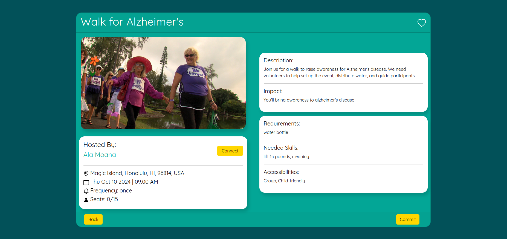

# Voluntree

<div class="text-center p-4">

</div>

```Language(s):``` Javascript, HTML, CSS

```Frameworks/Libraries:``` React.js, Meteor.js, Semantic UI

```Database:``` MongoDB

## Problem:
In Hawaii, the absence of a streamlined, accessible platform for volunteers and philanthropists presents a significant challenge. The lack of local infrastructure makes it difficult for individuals to find and engage in volunteer opportunities effectively. Consequently, there's a disconnect between those eager to help and the communities in need.

## Our Solution:
Voluntree is a simple, easy-to-use interface that allows users to post and commit to events quickly. It manages and matches willing volunteers with nonprofits and other organizations.

## Discovering Events:
Users can freely browse available events without needing an account, search by keywords, or filter by category. To participate in an event, they simply need to click on the event card and select the “Commit” button.

<div class="container">
    <div class="text-center">
        
        
    </div>
</div>

## Organizations:
Empower your organization's impact with Voluntree. Seamlessly create and manage your organization, effortlessly publish and oversee events, and efficiently track volunteer hours—all within an intuitive interface designed to enhance your organization's outreach and effectiveness.

<div class="container">
    <div class="text-center">
        
        
        
    </div>
</div>


