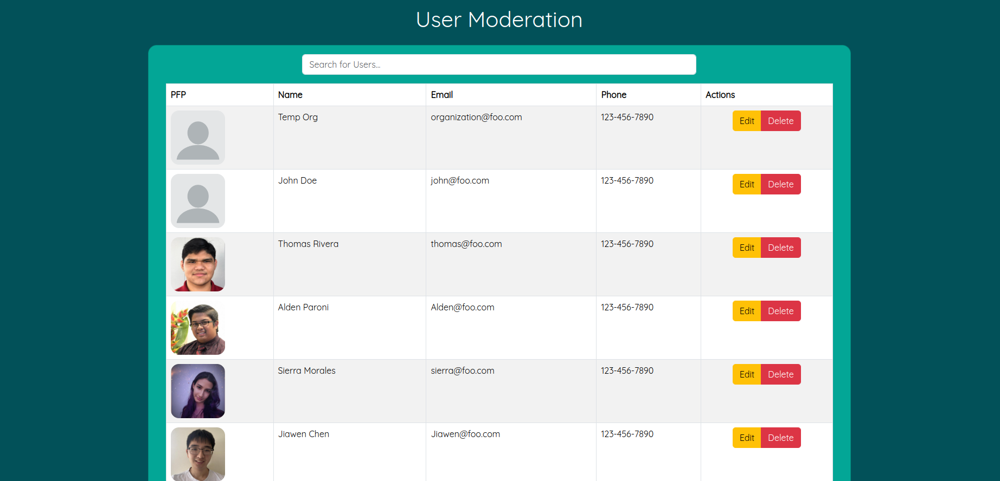

<div class="text-center p-4">

</div>

```Language(s):``` Javascript, HTML, CSS

```Frameworks/Libraries:``` React.js, Meteor.js, Semantic UI

```Database:``` MongoDB

## Problem:
In Hawaii, the absence of a streamlined, accessible platform for volunteers and philanthropists presents a significant challenge. The lack of local infrastructure makes it difficult for individuals to find and engage in volunteer opportunities effectively. Consequently, there's a disconnect between those eager to help and the communities in need.

## Our Solution:
Voluntree is a simple, easy-to-use interface that allows users to post and commit to events quickly. It manages and matches willing volunteers with nonprofits and other organizations.

## Discovering Events:
Users can freely browse available events without needing an account, search by keywords, or filter by category. To participate in an event, they simply need to click on the event card and select the “Commit” button.

<div class="container py-3">
    <div class="text-center">
        
    </div>
    <div class="text-center">
        
    </div>
</div>

## Organizations:
Empower your organization's impact with Voluntree. Seamlessly create and manage your organization, effortlessly publish and oversee events, and efficiently track volunteer hours—all within an intuitive interface designed to enhance your organization's outreach and effectiveness.

<div class="container py-3">
    <div class="text-center">
        
    </div>
    <div class="text-center">
        
    </div>
    <div class="text-center">
        
    </div>
</div>

## Contributions:
Acting as the project lead, I helped develop ideas and features for Voluntree. I worked on the front and back end, creating new features and managing their progress. Back-end development involved creating collections and methods. On the front end, I immersed myself in user interface design that works great on both desktop and mobile devices. Leveraging my React Bootstrap, CSS, and JavaScript proficiency, Voluntree quickly came to life with a cohesive and pleasing look.

### Highlights:
<hr />
#### User/Organization Hour Recording
Volunteers effortlessly log their hours using a personalized QR code. When volunteers attend an event, organizations simply scan their unique QR code to record their participation hours. This streamlined process ensures efficient tracking and management of volunteer hours.

<div class="container py-3">
    <div class="text-center">
        
    </div>
    <div class="text-center">
        
    </div>
</div>

#### Event Search
Finding events is made fast and simple through the intuitive design of the Find Events page. By default, users are presented with the latest events, ensuring they stay up-to-date with the most relevant opportunities. Additionally, users can easily discover events using a fuzzy search feature, allowing them to search by event names, locations, organizations, or descriptions easily. A filter option is available for further refinement, enabling users to sort events by categories such as "Environmental Conservation," thus tailoring their search to precisely match their interests and preferences.

<div class="container py-3">
    <div class="text-center">
        
    </div>
    <div class="text-center">
        
    </div>
</div>

#### Admin Site Management
Admins wield comprehensive control over the site's operations through the intuitive dashboard interface. This centralized hub provides access to vital site statistics, highlights recently published events, and offers convenient shortcuts to key site management functionalities. Admins possess the authority to edit or delete various site components, including events, organizations, users, and reviews. This robust suite of tools enables admins to maintain the site's integrity, ensuring smooth operations and facilitating timely interventions when necessary.

<div class="container py-3">
<div class="row">
    <div class="text-center">
        
    </div>
</div>
<div class="row">
<div class="col-sm-12 col-md-6 px-1">
    <div class="text-center">
        
    </div>
    <div class="text-center">
        
    </div>
</div>
<div class="col-sm-12 col-md-6 px-1">
    <div class="text-center">
        
    </div>
    <div class="text-center">
        
    </div>
</div>
</div>
</div>

## What Went Well:
Collaborative teamwork was the cornerstone of Voluntree's development. Despite the challenges posed by remote work, our team's commitment to effective communication ensured success. We commenced by establishing a clear plan and shared vision, fostering cohesion and understanding among all members. This strategic approach streamlined our workflow, facilitating rapid development with minimal confusion or setbacks.

Despite the limited time constraints, our team successfully developed a web app that addressed a wide range of customer requirements. By prioritizing tasks and focusing on the most critical features, we maximized our productivity and delivered a comprehensive solution within the allocated timeframe. Throughout the development process, we remained agile and adaptable, making strategic decisions to ensure that we met the customer's most essential needs while optimizing resource utilization. By leveraging our collective expertise and collaborating effectively, we were able to streamline workflows, overcome challenges, and make efficient use of our limited time.

## What Was Challenging:
Aligning our project goals with the customer's goals presented a significant challenge throughout the development of Voluntree. While we had a clear vision for the platform's functionality and features, ensuring that these objectives resonated with the customer's needs and expectations required careful navigation. One aspect of this challenge stemmed from the inherent complexity of understanding and interpreting the customer's priorities and preferences. Despite our best efforts to gather feedback and insights, there were instances where differing perspectives led to misunderstandings.

To address this challenge, regular check-ins and customer feedback should be sought. Even through email, discussing any emerging challenges or changes would ensure the project remains on track to meet the customer’s expectations. Actively seeking customer feedback at key milestones would allow the team to validate assumptions, gather insights, and make course corrections as needed.

Additionally, maintaining consistent communication among team members presented another notable challenge. Despite our initial emphasis on the importance of communication, there were instances where communication became sparse or fragmented, hindering our team's efficiency and cohesion. One contributing factor to this challenge was the lack of transparency. Some people would leave for days without notice or make something of importance known at the last minute, leading to delays in response or miscommunication, impacting the overall follow of communication.

In the future, I intend to implement a more rigorous meeting schedule to proactively address the communication challenges that arose during development. This entails establishing a structured cadence for team meetings and ensuring that they occur regularly and consistently to facilitate ongoing communication and collaboration among team members. I also intend to implement policies regarding excused absences to ensure that everyone remains committed and accountable to the team's efforts.

## Improvements:
While the application is functional and successfully incorporates many of the basic features requested by the customer, it's important to acknowledge that certain areas still need more depth or refinement. For example, admin moderation needs to be fleshed out with user notifications, better UI, and review editing. Doing this across the site would help make the site feel more sophisticated. This process underscores our commitment to delivering a comprehensive solution that exceeds the customer's expectations and enhances the overall user experience.

## Team:
```Members:``` Thomas Rivera, Sierra Morales, Alden Paroni, Jiawen Chen, Jianle Liu, HokWai Chan, Ryan Seng, William Simmons

## Links:
To see more about Voluntree, please visit the following links:

```Source Code:```[GitHub Repo](https://github.com/Ube-Dev/Voluntree)

```Page:``` [Voluntree](https://ube-dev.github.io/)
